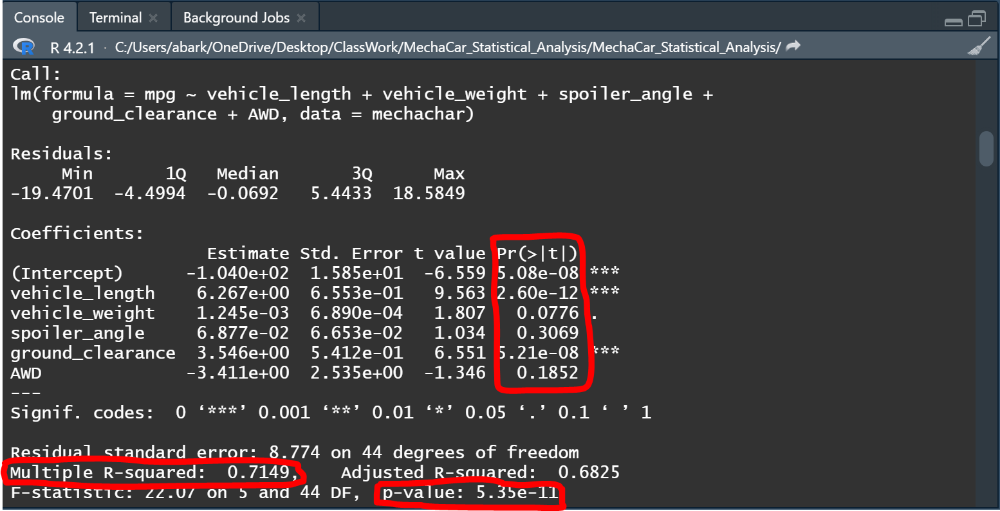
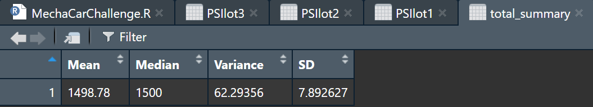
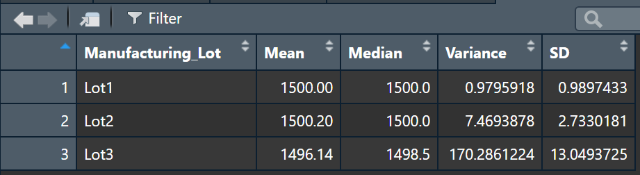
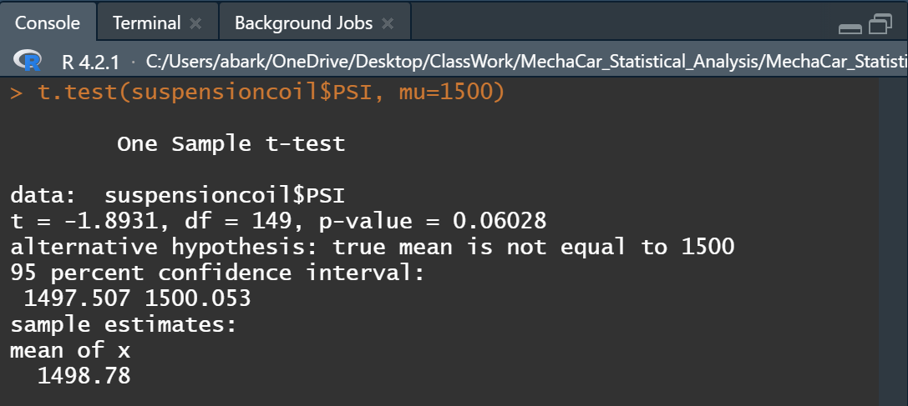
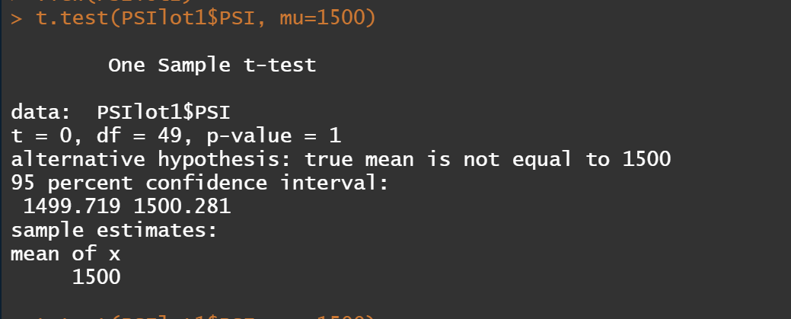

# MechaCar_Statistical_Analysis

## Overview of the project:

#### In this project we are helping Jeremy and his Data Analytics team overcome some of the issues that are preventing AutosRUs' newest prototype, The MachaCar, from developping.
#### The MachaCar prototype is suffering from production troubles that are blocking the manufacturing team’s progress. AutosRUs’ upper management has called on Jeremy and the data analytics team to review the production data for insights that may help the manufacturing team.

#### Our goal while helping Jeremy and his team is to do the following:
* Perform multiple linear regression analysis to identify which variables in the dataset predict the mpg of MechaCar prototypes.
* Collect summary statistics on the pounds per square inch (PSI) of the suspension coils from the manufacturing lots.
* Run t-tests to determine if the manufacturing lots are statistically different from the mean population.
* Design a statistical study to compare vehicle performance of the MechaCar vehicles against vehicles from other manufacturers.

## Linear Regression to Predict MPG

#### To help explain what we accomplished in the above chart, we are answering the questions below,
* Q - Which variables/coefficients provided a non-random amount of variance to the mpg values in the dataset?
* A - By looking at the summary for the Linear Regression provided, we notice that the Vehicle_Length and Ground_Clearance variables both have a very low p-value, (2.60e-12) and (5.21e-08), consecutively. Since this value is less than 0.05, both variables have a statistically significant relationship to our MPG values.
* Q - Is the slope of the linear model considered to be zero? Why or why not?
* A - Acoording to the multiple linear regression summary, our p-value is also less than our assumed significance level of 0.05, which allows us to reject our NULL Hypothesis and confirm the slpoe of this model isn't zero.
* Q - Does this linear model predict mpg of MechaCar prototypes effectively? Why or why not?
* A - Our R-squared value for this linear model is 0.7149. Over 70% of predictions for MPG in the MechaCar prototype will be valid using this linear model.

## Summary Statistics on Suspension Coils

#### The design specifications for the MechaCar suspension coils dictate that the variance of the suspension coils must not exceed 100 pounds per square inch. 
#### Looking at the Total Summary displayed above we can clearly see that the variance for all Manufacturing lots in total is equal to 62.29psi, less than 100 psi, which means that overall the lots in toal do meet the specification for the design.

#### However, our Lot Summary screenshot below shows that Lot 3's variance is 170.28psi which is way above the design requirement.
#### Lot1 & Lot2 are also within the design range, with variances of 0.98 and 7.47 respectively.

## T-Tests on Suspension Coils

#### Below is a summary of the t-test results across all manufacturing lots:

Our p-value in this test is 0.06, which is above our significance level of 0.05. Which allows us to accept our null hypothesis, that all means for the three manufacturing lots are NOT different than the population mean of 1500.

#### The p-value for each of the manufacturing lots in the Suspension Coil dataset are as below,

* Lot 1 p-value: 1
* Lot 2 p-value: 0.6072
* Lot 3 p-valur: 0.0416

#### p-values of Lot1 and Lot2 are both above our significance level, which means that we accept our null hypthesis and that the means for both lots are similar to the population mean of 1500. (This "mean" result is also displayed below in the summary for the t-tests 1500 and 1500.2 respectively).
#### On the other hand, the p-value for Lot3 is 0.0416 and is lower than our significance level, which helps us reject the null hypothesis and indicate that the mean for Lot3 (1496.14) is different from the population mean of 1500.

## Study Design: MechaCar vs Competition

#### Using our knowledge of R, we were tasked to design a statistical study to compare performance of the MechaCar vehicles against performance of vehicles from other manufacturers.
#### Potential vehicle buyers are usually considering few factors prior to making a car purchase, one of the factors we focus on in here is Automotive Engine Longevity', or AEL.
* AEL could be a metric that we study and compare with other car manufacturing companies.
* Our Null Hypothesis would be that Engine Longivety within the competitors' cars and MechaCar are simmilar.
* We can use a Multiple Linear Regression to determine how do MechaCar engine perform vs. other competitors in the market.
* To perform the above test, we would need to collect data for specific types of vehicles, from comparable companies, for a certain period of time to be able to compare. Few factors to consider would be, Miles per Hour, Weight of Vehicle, Miles Driven, Towing activities (as a Y/N Boolean), Number of Cylinders. 

